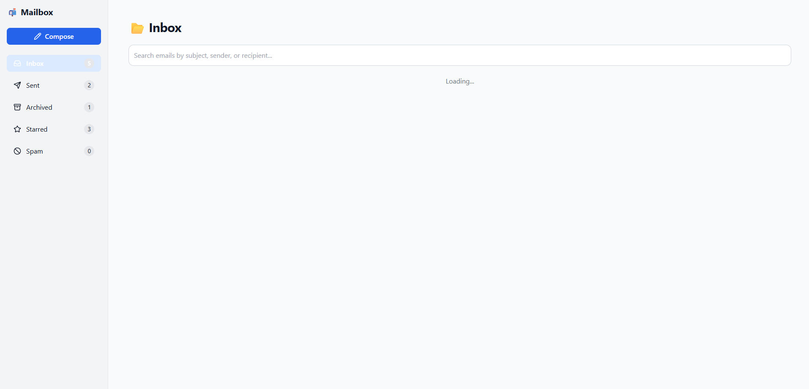
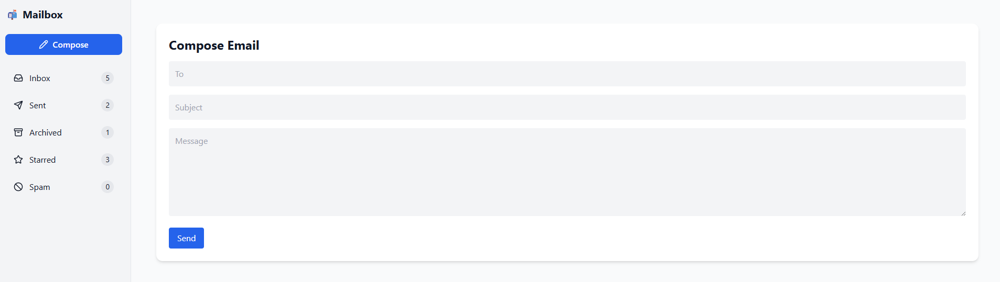

# 📬 ReachMail

ReachMail is a full-stack AI-powered email management system. It offers real-time IMAP sync, intelligent search, folder-based categorization, and AI-assisted reply suggestions using Retrieval-Augmented Generation (RAG). Built with Node.js and React (Next.js), ReachMail combines modern UX with smart features for enhanced productivity.

## 🚀 Features

- ✅ **IMAP Email Sync** (real-time)
- 🔍 **Full-text search** via Elasticsearch
- 🗂️ **Folder-based categorization** (Inbox, Sent, Spam, Starred, Archived)
- 📝 **Compose, Delete, Archive, and Star Emails**
- 🤖 **AI-Powered Suggested Replies** using OpenAI's GPT-4 + RAG
- 💬 **Responsive UI** built with TailwindCSS & Lucide Icons
- 📊 **Live folder counts and bulk operations**

## 🧠 Tech Stack

| Frontend | Backend | AI | Storage |
|----------|---------|----|---------|
| React (Next.js) | Node.js (Express) | OpenAI GPT-4 | IMAP (Email), Elasticsearch |
| Tailwind CSS | Axios | RAG architecture | ChromaDB |

---

## 📸 Screenshots

| Home Page | Compose Email |
|-----------|----------------|
|  |  |
---
## 🛠️ Setup Instructions:

- Clone the repository
  ```bash
  git clone https://github.com/MadhalasaSJ/reachmail.git
  cd reachmail

- Install dependencies
  ```bash
  # Backend
  cd backend
  npm install
  
  # Frontend
  cd ../client
  npm install

- Create .env in server/
  ```bash
  OPENAI_API_KEY=your_openai_key_here
  IMAP_HOST=imap.example.com
  IMAP_PORT=993
  IMAP_USER=your_email@example.com
  IMAP_PASSWORD=your_password

- Start the servers
  ```bash
  # Backend
  cd backend
  npm run dev
  
  # Frontend
  cd ../frontend
  npm run dev

## 🤖 AI Integration (RAG)
- GPT-4 via OpenAI API
- RAG (Retrieval-Augmented Generation) used to contextually answer or suggest replies to incoming emails based on previous correspondence or stored prompts.

## 💡 Future Enhancements

- OAuth2 email login  
- Sentiment-based priority inbox  
- Slack/webhook integrations  
- Analytics dashboard for email interactions

---  

## 📁 Folder Structure

```bash
reachmail/
├── frontend/             # Next.js frontend
│   ├── components/
│   ├── pages/
│   └── ...
├── server/             # Express backend
│   ├── backend/
│   ├── services/
│   ├── app.ts
│   └── ...
└── README.md
